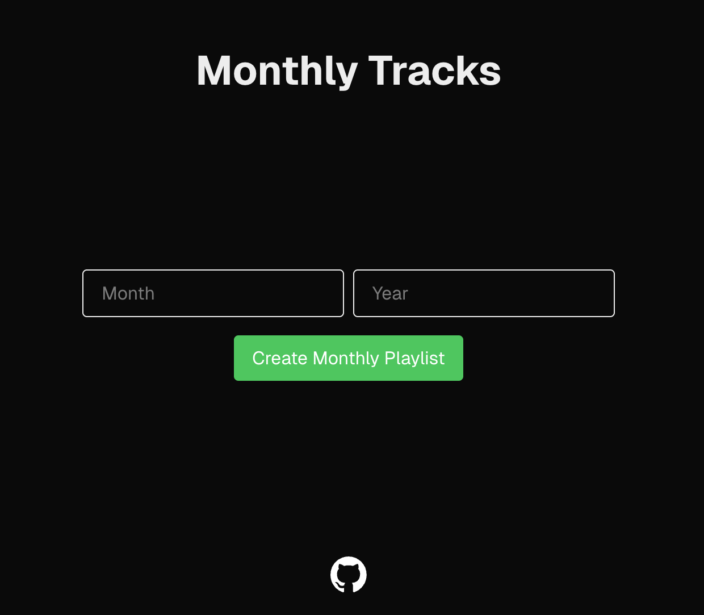

# Monthly Tracks 🥁

## Overview

A Next.js web application that automatically generates monthly playlists on Spotify based on the music added to your library during that month.

## Features

- 🔐 Secure Spotify OAuth login
- 📅 Create monthly playlists for any month/year
- 🎵 Automatic track collection from your listening history
- 🎨 Responsive UI with Tailwind CSS
- ⚡️ Fast performance with Next.js

## Tech Stack

- **Framework**: [Next.js](https://nextjs.org/)
- **Styling**: [Tailwind CSS](https://tailwindcss.com/)
- **Authentication**: [NextAuth](https://next-auth.js.org/)
- **Package Manager**: [pnpm](https://pnpm.io/)
- **Language**: [TypeScript](https://www.typescriptlang.org/)

## Getting Started

### Prerequisites

- Node.js v18+
- pnpm (`npm install -g pnpm`)
- Spotify Developer Account

### Installation

1. Clone the repository

2. Install the dependencies

```bash
pnpm install
```

3. Create a Spotify Developer Account and set up a new application to get your client ID and client secret. Here's a link on how to create a Spotify Developer Application: [Spotify Developer Dashboard](https://developer.spotify.com/documentation/web-api/concepts/apps)

4. In the Spotify Developer Dashboard, add a redirect URI for your application. This should be the URL where users will be redirected after logging in with Spotify. For development, you can use `http://localhost:3000/api/auth/callback/spotify`. In this application dashboard you will also need to add any user you want to grant access to your application.

5. Create a copy of the `.env.example` file and rename it to `.env`. Fill in your Spotify client ID and client secret in the `.env` file. Remember to also add a secret for NextAuth.

6. Start the development server and start creating monthly tracks! 🕺

```bash
pnpm dev
```


